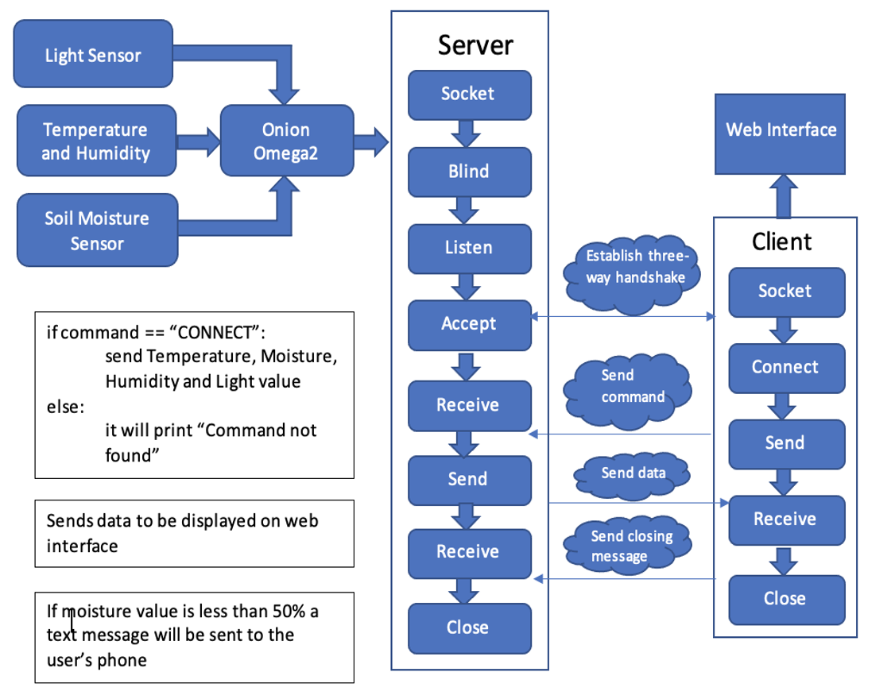
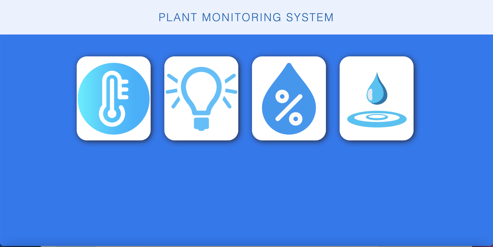
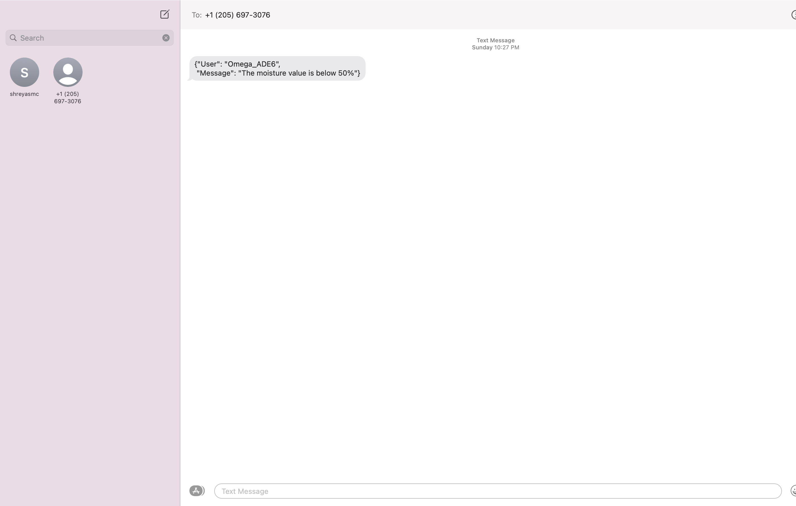
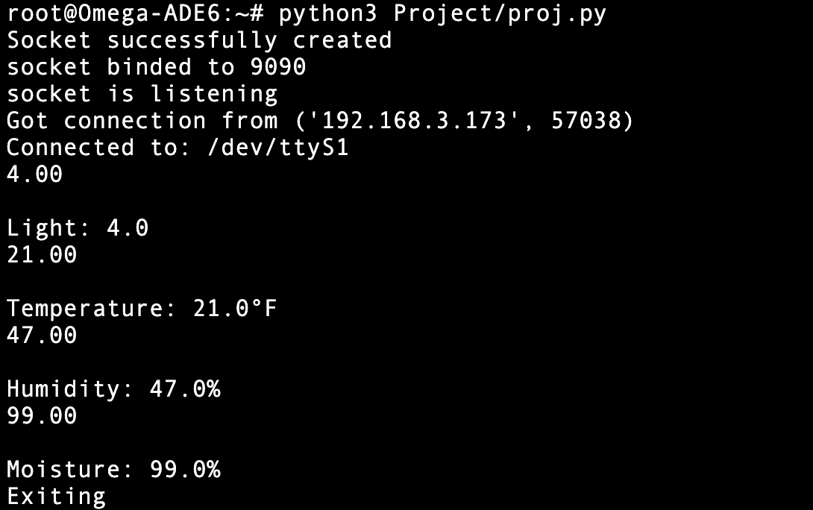
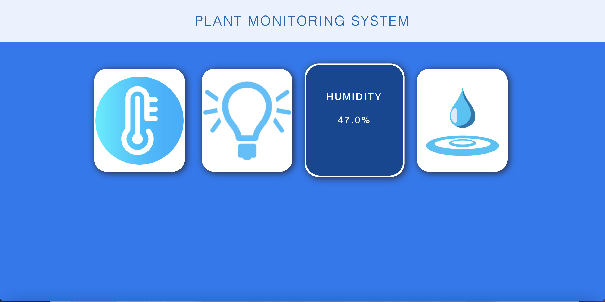

# IoT-Based-Plant-Monitoring-System(Built with Python, HTML and CSS)

## Introduction
This IoT Based Plant Monitoring System will help to monitor certain plant attributes like light received, moisture level, temperature, and humidity with the help of some sensors. If the moisture level fall below a certain value, we will receive a notification through a text message. We will be establishing a socket-based communication between the Omega and the laptop wherein the omega will act as a server and the laptop will act as a client. All the data sent from the sensors will be display on a web interface. 

## Links

#### Demo video: http://www.youtube.com/watch?v=q-6uZqlhOtI

## Uses
Monitor plant attributes like light level, moisture level, temperature and humidity level

## Requirements
Omega2, Connecting cables, temperature and humidity sensor, light sensor, Soil moisture sensor Y-69 and Arduino Dock

## Connections 
First connect the Omega2 to the Arduino dock. Then connect the sensor modules to the Arduino Dock using the connecting cables. Use a MicroUSB Port to supply power to the Arduino Dock.

## Installation
* Arduino IDE
* AWSIoTPythonSDK
* Socket 
* Flask

## Built With
* Python
* HTML5
* CSS
* Arduino
* Sensors

## Flowchart

## Working
* Step-by-step Instructions:
  * First upload the Final_Proj.ino code to the Omega. Run the Proj_server.py code on the Omega terminal and then run the Proj_client.py on the client(Laptop). This will establish a connection with the IoT device via socket communication.

  * After the connection is established, we send a command to the IoT device using the client terminal.

  * If the command is “CONNECT” it will collect temperature, moisture, humidity and light value from the IoT device else it will say "No command found".

  * After the data values are sent to the client the connection between client and server is terminated.

  * The data values are then available to the user via a web interface.

  * The user will be able to see the data values by hovering over the images of temperature, light, moisture, or humidity.

  * If the moisture value is lower than 50% a text message will be sent to the user saying, "Moisture value is below 50%”. This is done using mqtt and creating a rule to send a text message using mqtt. 

## Developers
* Dylan Dias - @dylandias99 - https://github.com/dylandias99

## Screenshots
#### Web Interface                               

#### Text Message                             

#### Terminal                             

#### Hover Output                             

